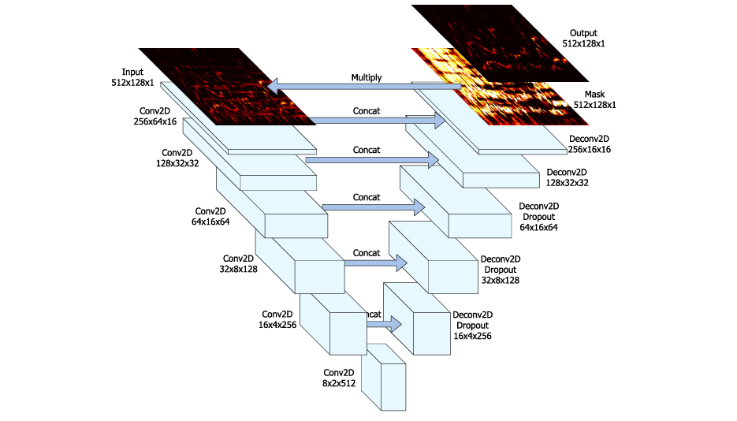

# Singing Voice Separation with U-Net

Implementation of the U-Net architecture for singing voice separation based on the paper [*"Singing Voice Separation with Deep U-Net Convolutional Networks"*](https://openaccess.city.ac.uk/id/eprint/19289/) by Jansson et al. (2017).

## Overview

This project implements a deep U-Net convolutional network to separate singing voices from musical accompaniment using the MUSDB18 dataset.

## Architecture

The U-Net consists of:
- **Encoder**: 6 convolutional layers with downsampling
- **Decoder**: 6 transposed convolutional layers with upsampling
- **Skip connections**: Preserve fine-grained spectral details
- **Output**: Soft mask [0,1] applied to mixture spectrogram
- **Loss function**: L1 (MAE)

## Dataset

- **MUSDB18**: 150 full-length tracks
- **Preprocessing**: STFT (n_fft=1024, hop_length=768, sr=8192Hz)
- **Normalization**: Per-song (magnitude / max(mixture))
- **Patches**: 128 frames (~11 seconds)

## Training

- **Epochs**: 160
- **Batch size**: 8
- **Optimizer**: Adam (lr=1e-3)
- **Loss**: Decreased from ~0.006 to ~0.0024

The model shows good convergence with both training and validation losses decreasing smoothly without overfitting.

## Results

After 160 epochs of training:

| Metric | Score |
|--------|-------|
| SIR (Signal-to-Interference Ratio) | ~14 dB |

The model successfully isolates vocals from accompaniment. Training for more epochs (500-1000) would likely improve performance further, as indicated by the continued downward trend in the loss curves.
s
## References

Jansson, A., Humphrey, E., Montecchio, N., Bittner, R., Kumar, A., & Weyde, T. (2017). Singing voice separation with deep U-Net convolutional networks. *ISMIR 2017*.

## Author

Arezki HADDOUCHE - M2 Automatique Robotique, Sorbonne Université